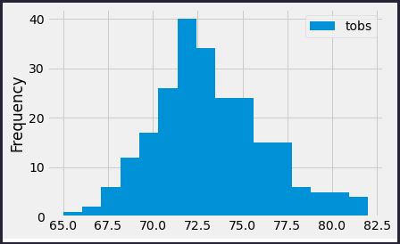

# Surf's Up

## Project Overview
In order to determine if a surf and ice cream shop can be a successful venture an investor has asked for weather analysis to be provided for the Hawaiin island of Oahu, the proposed location of the new business. A SQLite dataset was provided with the necessary weather observation data to run the desired investor analytics. With a sound business plan already in place, it is important that the weather statistics be examined carefully to ensure investors are comfortable in supporting this venture. The concern right now is whether the surf and ice cream shop business is sustainable year-round based on the weather. With this goal in mind, we are tasked with retrieving more information about temperature trends on Oahu for the months of June and December. We will make a comparative analysis and provide information and charts with the results.

- Deliverables:
  1. Retrieve all datapoints for June and provide a statistical summary.
  2. Retrieve all datapoints for December and provide a statistical summary.

## Resources
- Data Source(s) : hawaii.sqlite weather history data
- Software: Python 3.7.10, Visual Studio Code 1.56.2, Jupyter Notebook Server 6.3.0, SQLAlchemy 1.4.7

## Results

### Analysis of June Temperatures
Taking a look at all 1700 data points provided in the data for the month of June we can see that the mean temperature is just a bit under 75 degree Fahrenheit. Further, the distribution patterns appears to be symmetrical based on the 25% and 75% quartiles being the exact distance away from the median and within a rounding factor of the mean.

### Analysis of December Temperatures
A similar result to the June observations where we have a mean and median that are very close in value, also indicating a symmetrical distribution pattern. Here, we have a larger standard deviation, meaning that the base around the mean is larger and the distribution pattern a little wider than June. The 25% and 75% quartile numbers are very close to equal distance apart form the mean.

### Key differences between the weather in June and December
- The temperatures in December are approximately 3-4% degrees lower than in June
- The standard deviation of the temperature in December is higher that June, this means that there is more variance in the temperature range from the mean during December compared to June. We can see this in the comparison bar charts where there is much more fluctuations in the December temperatures, whereas the June temperatures have more consistency to them centered arounf the mean.
- It appears that we also have a difference in the number of temperature observations in June(1700) vs December(1517), this might explain the larger standard deviation calculated for December versus June. We can see in the bar chart where there are missing gaps in the December data, about 10.7% less observations than in the month of June.

### Supplemental Queries and Histograms for June and December

When we look at the most active station(USC00519281) that contributed temperature observations to our dataset we can see that a location close to this station would be a good choice based on the consistent temperature values. More than 90% of the observations are for temperatures higher that 68 degrees in June. For the month of December 85% of the observations from this station provided temperatures greater than 66 degrees Fahrenheit. Consistent temperatures greater 66 degrees when we consider both months together, gives us confidence in our choice of location and also confirms that the temperature meets the needs of a ice cream business.

## Overall Summary

As we review the analysis provided above we can come to a clear conclusion that the temperature difference from June compared to December is about 3-4 degrees. We can see the consistency in temperatures shown in the bar charts for the different months of June and December. Further, the likely destination of Oahu near the weather observation station considered points to a reliable location for the business and supported by the consistent temperature distribution observed in the histograms. Investors should feel great confidence in investing in a venture such as this where the temperature trends point to a very favourable operating business environment for this enterprise.